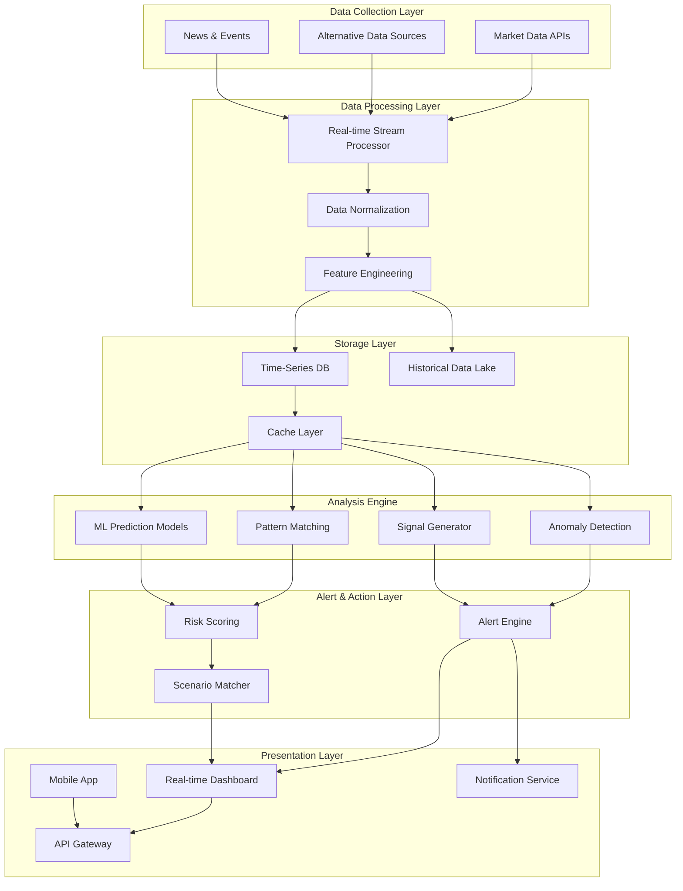

# 자금 흐름 예측 시스템 설계 (Money Flow Prediction System)

## 📋 시스템 개요

본 시스템은 글로벌 자금시장의 흐름을 실시간으로 추적하고, 머신러닝 기반 예측 모델을 통해 자금 이동 방향을 예측하는 통합 플랫폼입니다.

### 핵심 목표
- **실시간 모니터링**: 채권, 통화, ETF, 파생상품 시장의 실시간 데이터 수집
- **조기 경보**: 자금 흐름 이상 징후 자동 탐지 및 알림
- **예측 분석**: 과거 패턴 매칭 및 ML 모델을 통한 향후 흐름 예측
- **의사결정 지원**: 시나리오별 대응 전략 제시

---

## 🏗️ 시스템 아키텍처



---

## 🔧 상세 컴포넌트 설계

### 1. Data Collection Layer (데이터 수집 계층)

#### 1.1 Market Data Collector

```python
# 데이터 소스 구성
DATA_SOURCES = {
    "free_tier": {
        "yahoo_finance": {
            "endpoint": "yfinance",
            "rate_limit": "2000/hour",
            "data_types": ["stocks", "etf", "forex", "indices"],
            "update_frequency": "1min"
        },
        "fred": {
            "endpoint": "https://api.stlouisfed.org/fred",
            "api_key": "required",
            "data_types": ["treasury_yields", "economic_indicators"],
            "update_frequency": "daily"
        },
        "alpha_vantage": {
            "endpoint": "https://www.alphavantage.co/query",
            "rate_limit": "5/min (free)",
            "data_types": ["forex", "crypto", "technical_indicators"],
            "update_frequency": "1min"
        }
    },
    
    "premium_tier": {
        "polygon_io": {
            "endpoint": "https://api.polygon.io",
            "data_types": ["stocks", "options", "forex", "crypto"],
            "update_frequency": "real-time",
            "cost": "$199/month"
        },
        "quandl": {
            "endpoint": "https://data.nasdaq.com/api/v3",
            "data_types": ["alternative_data", "futures", "options"],
            "update_frequency": "real-time"
        }
    },
    
    "alternative_data": {
        "unusual_whales": {
            "data_types": ["options_flow", "dark_pool"],
            "update_frequency": "real-time"
        },
        "whale_wisdom": {
            "data_types": ["13f_filings", "institutional_holdings"],
            "update_frequency": "quarterly"
        }
    }
}
```

#### 1.2 수집 대상 데이터

```python
# 채권 시장 데이터
BOND_MARKET_DATA = {
    "us_treasuries": [
        "^IRX",   # 13 Week Treasury Bill
        "^FVX",   # 5 Year Treasury Yield
        "^TNX",   # 10 Year Treasury Yield
        "^TYX"    # 30 Year Treasury Yield
    ],
    "spreads": {
        "yield_curve": "10Y - 2Y",
        "credit_spread": "HYG - LQD",
        "tips_spread": "TIP vs Nominal"
    }
}

# 통화 시장 데이터
FOREX_DATA = {
    "major_pairs": ["DXY", "EURUSD", "USDJPY", "GBPUSD"],
    "emerging": ["USDKRW", "USDCNY", "USDINR", "USDBRL"],
    "commodity_currencies": ["AUDUSD", "NZDUSD", "USDCAD"]
}

# ETF 자금 흐름
ETF_FLOW_DATA = {
    "equity": ["SPY", "QQQ", "IWM", "DIA"],
    "bonds": ["TLT", "SHY", "HYG", "LQD", "TIP"],
    "sectors": ["XLF", "XLE", "XLV", "XLK", "XLI"],
    "international": ["EWY", "EWJ", "EEM", "VWO", "EFA"],
    "volatility": ["VXX", "UVXY"]
}

# 파생상품 데이터
DERIVATIVES_DATA = {
    "volatility_indices": ["VIX", "VVIX", "MOVE"],
    "options_metrics": ["put_call_ratio", "skew_index", "open_interest"],
    "futures": ["ES", "NQ", "YM", "RTY"]  # E-mini futures
}
```

---

### 2. Data Processing Layer (데이터 처리 계층)

#### 2.1 실시간 스트림 프로세서

```python
from dataclasses import dataclass
from datetime import datetime
from typing import Dict, List, Optional
import asyncio

@dataclass
class MarketSignal:
    """시장 신호 데이터 구조"""
    timestamp: datetime
    signal_type: str  # 'bond', 'forex', 'etf', 'derivative'
    indicator: str
    value: float
    change_pct: float
    z_score: float  # 표준편차 기준
    anomaly_score: float  # 0-100
    metadata: Dict

class StreamProcessor:
    """실시간 데이터 스트림 처리"""
    
    def __init__(self):
        self.buffer = {}
        self.window_size = 100  # 이동평균 윈도우
        
    async def process_tick(self, data: Dict) -> Optional[MarketSignal]:
        """
        실시간 틱 데이터 처리
        - 정규화
        - 이상치 탐지
        - 신호 생성
        """
        normalized = self.normalize_data(data)
        z_score = self.calculate_z_score(normalized)
        
        if abs(z_score) > 2.0:  # 2 표준편차 이상
            return self.generate_signal(normalized, z_score)
        
        return None
    
    def calculate_z_score(self, data: Dict) -> float:
        """Z-Score 계산 (이상치 탐지)"""
        # 이동평균 및 표준편차 기반 계산
        pass
    
    def normalize_data(self, data: Dict) -> Dict:
        """데이터 정규화"""
        # 다양한 소스의 데이터를 통일된 형식으로 변환
        pass
```

#### 2.2 Feature Engineering

```python
class FeatureEngineer:
    """예측 모델을 위한 피처 생성"""
    
    def create_features(self, market_data: Dict) -> Dict:
        """
        다차원 피처 생성
        """
        features = {}
        
        # 1. 기술적 지표
        features.update(self.technical_indicators(market_data))
        
        # 2. 시장 구조 지표
        features.update(self.market_structure_indicators(market_data))
        
        # 3. 크로스 마켓 지표
        features.update(self.cross_market_indicators(market_data))
        
        # 4. 센티먼트 지표
        features.update(self.sentiment_indicators(market_data))
        
        return features
    
    def technical_indicators(self, data: Dict) -> Dict:
        """기술적 지표 계산"""
        return {
            "rsi": self.calculate_rsi(data),
            "macd": self.calculate_macd(data),
            "bollinger_bands": self.calculate_bollinger(data),
            "momentum": self.calculate_momentum(data)
        }
    
    def market_structure_indicators(self, data: Dict) -> Dict:
        """시장 구조 지표"""
        return {
            "yield_curve_slope": self.calc_yield_curve_slope(data),
            "credit_spread": self.calc_credit_spread(data),
            "liquidity_index": self.calc_liquidity_index(data),
            "volatility_regime": self.identify_vol_regime(data)
        }
    
    def cross_market_indicators(self, data: Dict) -> Dict:
        """크로스 마켓 상관관계"""
        return {
            "equity_bond_correlation": self.calc_correlation("equity", "bond"),
            "dollar_commodity_correlation": self.calc_correlation("dxy", "commodities"),
            "risk_parity_signal": self.calc_risk_parity_signal(data)
        }
```

---

### 3. Analysis Engine (분석 엔진)

#### 3.1 Anomaly Detection (이상 탐지)

```python
from sklearn.ensemble import IsolationForest
from sklearn.preprocessing import StandardScaler
import numpy as np

class AnomalyDetector:
    """이상 징후 탐지 시스템"""
    
    def __init__(self):
        self.models = {
            "isolation_forest": IsolationForest(contamination=0.1),
            "statistical": StatisticalAnomalyDetector(),
            "pattern_based": PatternAnomalyDetector()
        }
        
    def detect_anomalies(self, features: Dict) -> List[Dict]:
        """
        다중 방법론을 통한 이상 탐지
        """
        anomalies = []
        
        # 1. 통계적 이상치 탐지
        stat_anomalies = self.statistical_detection(features)
        
        # 2. 머신러닝 기반 이상치 탐지
        ml_anomalies = self.ml_detection(features)
        
        # 3. 패턴 기반 이상치 탐지
        pattern_anomalies = self.pattern_detection(features)
        
        # 결과 통합 및 우선순위 부여
        return self.merge_and_prioritize([
            stat_anomalies, 
            ml_anomalies, 
            pattern_anomalies
        ])
    
    def statistical_detection(self, features: Dict) -> List[Dict]:
        """통계적 방법 (Z-Score, IQR)"""
        anomalies = []
        
        for key, value in features.items():
            z_score = self.calculate_z_score(value)
            if abs(z_score) > 3.0:  # 3-sigma rule
                anomalies.append({
                    "type": "statistical",
                    "indicator": key,
                    "severity": "high" if abs(z_score) > 4 else "medium",
                    "z_score": z_score,
                    "value": value
                })
        
        return anomalies
```

#### 3.2 Signal Generator (신호 생성기)

```python
class SignalGenerator:
    """거래 신호 생성"""
    
    def __init__(self):
        self.signal_rules = self.load_signal_rules()
        
    def generate_signals(self, market_state: Dict) -> List[Dict]:
        """
        시장 상태 기반 신호 생성
        """
        signals = []
        
        # 시나리오 A: 한국 자금 유출 감지
        if self.check_korea_outflow(market_state):
            signals.append({
                "scenario": "korea_capital_outflow",
                "severity": "high",
                "confidence": 0.85,
                "triggers": [
                    "한미 금리차 역전",
                    "USDKRW 급등",
                    "EWY 순유출"
                ],
                "recommendation": "포지션 축소 또는 헤지 검토"
            })
        
        # 시나리오 B: 리스크오프 전환
        if self.check_risk_off(market_state):
            signals.append({
                "scenario": "risk_off_transition",
                "severity": "critical",
                "confidence": 0.90,
                "triggers": [
                    "VIX 급등",
                    "TLT 대량 유입",
                    "HYG 스프레드 확대"
                ],
                "recommendation": "주식 비중 축소, 현금/단기채 확보"
            })
        
        # 시나리오 C: 유동성 위기
        if self.check_liquidity_crisis(market_state):
            signals.append({
                "scenario": "liquidity_crisis",
                "severity": "critical",
                "confidence": 0.75,
                "triggers": [
                    "LIBOR-OIS 스프레드 급등",
                    "레포 금리 스파이크",
                    "MOVE 지수 급등"
                ],
                "recommendation": "극도로 보수적 포지션, 현금 확보"
            })
        
        return signals
    
    def check_korea_outflow(self, state: Dict) -> bool:
        """한국 자금 유출 체크"""
        conditions = [
            state.get("korea_us_rate_diff", 0) < -0.5,  # 한미 금리차
            state.get("usdkrw_change_1d", 0) > 1.0,     # 원달러 1일 변동
            state.get("ewy_flow_3d", 0) < 0,            # EWY 3일 흐름
            state.get("kospi_foreign_flow", 0) < 0      # 외국인 순매도
        ]
        
        return sum(conditions) >= 3  # 4개 중 3개 이상 충족
```

#### 3.3 ML Prediction Models (예측 모델)

```python
import torch
import torch.nn as nn
from transformers import AutoModel

class MoneyFlowPredictor:
    """자금 흐름 예측 모델"""
    
    def __init__(self):
        self.models = {
            "lstm": self.build_lstm_model(),
            "transformer": self.build_transformer_model(),
            "ensemble": self.build_ensemble_model()
        }
        
    def build_lstm_model(self):
        """LSTM 기반 시계열 예측"""
        class LSTMPredictor(nn.Module):
            def __init__(self, input_size, hidden_size, num_layers):
                super().__init__()
                self.lstm = nn.LSTM(input_size, hidden_size, num_layers, batch_first=True)
                self.fc = nn.Linear(hidden_size, 3)  # 3-class: 유입/중립/유출
                
            def forward(self, x):
                lstm_out, _ = self.lstm(x)
                predictions = self.fc(lstm_out[:, -1, :])
                return predictions
        
        return LSTMPredictor(input_size=50, hidden_size=128, num_layers=2)
    
    def build_transformer_model(self):
        """Transformer 기반 예측 (장기 의존성 포착)"""
        class TransformerPredictor(nn.Module):
            def __init__(self, d_model=256, nhead=8, num_layers=6):
                super().__init__()
                self.transformer = nn.TransformerEncoder(
                    nn.TransformerEncoderLayer(d_model, nhead),
                    num_layers
                )
                self.fc = nn.Linear(d_model, 3)
                
            def forward(self, x):
                transformer_out = self.transformer(x)
                predictions = self.fc(transformer_out[:, -1, :])
                return predictions
        
        return TransformerPredictor()
    
    def predict_flow_direction(self, features: Dict, horizon: str = "24h") -> Dict:
        """
        자금 흐름 방향 예측
        
        Args:
            features: 입력 피처
            horizon: 예측 기간 (24h, 48h, 1w)
        
        Returns:
            예측 결과 및 확률 분포
        """
        # 앙상블 예측
        lstm_pred = self.models["lstm"](features)
        transformer_pred = self.models["transformer"](features)
        
        # 가중 평균
        ensemble_pred = 0.6 * transformer_pred + 0.4 * lstm_pred
        
        # 확률 분포로 변환
        probabilities = torch.softmax(ensemble_pred, dim=-1)
        
        return {
            "direction": ["outflow", "neutral", "inflow"][probabilities.argmax()],
            "confidence": probabilities.max().item(),
            "probability_distribution": {
                "outflow": probabilities[0].item(),
                "neutral": probabilities[1].item(),
                "inflow": probabilities[2].item()
            },
            "horizon": horizon
        }
```

---

### 4. Alert & Action Layer (알림 및 액션 계층)

#### 4.1 Alert Engine

```python
from enum import Enum
from typing import List, Callable

class AlertSeverity(Enum):
    INFO = 1
    WARNING = 2
    CRITICAL = 3
    EMERGENCY = 4

class AlertEngine:
    """실시간 알림 시스템"""
    
    def __init__(self):
        self.alert_rules = self.load_alert_rules()
        self.notification_channels = {
            "email": EmailNotifier(),
            "slack": SlackNotifier(),
            "sms": SMSNotifier(),
            "webhook": WebhookNotifier()
        }
        
    def evaluate_alerts(self, signals: List[Dict]) -> List[Dict]:
        """신호 평가 및 알림 생성"""
        alerts = []
        
        for signal in signals:
            severity = self.calculate_severity(signal)
            
            if severity >= AlertSeverity.WARNING:
                alert = {
                    "id": self.generate_alert_id(),
                    "timestamp": datetime.now(),
                    "severity": severity,
                    "signal": signal,
                    "message": self.format_alert_message(signal),
                    "actions": self.suggest_actions(signal)
                }
                
                alerts.append(alert)
                self.dispatch_alert(alert)
        
        return alerts
    
    def calculate_severity(self, signal: Dict) -> AlertSeverity:
        """신호 심각도 계산"""
        confidence = signal.get("confidence", 0)
        impact = signal.get("impact_score", 0)
        
        severity_score = confidence * impact
        
        if severity_score > 0.8:
            return AlertSeverity.EMERGENCY
        elif severity_score > 0.6:
            return AlertSeverity.CRITICAL
        elif severity_score > 0.4:
            return AlertSeverity.WARNING
        else:
            return AlertSeverity.INFO
    
    def dispatch_alert(self, alert: Dict):
        """알림 발송"""
        severity = alert["severity"]
        
        # 심각도에 따라 다른 채널 사용
        if severity == AlertSeverity.EMERGENCY:
            self.notification_channels["sms"].send(alert)
            self.notification_channels["slack"].send(alert)
            self.notification_channels["email"].send(alert)
        elif severity == AlertSeverity.CRITICAL:
            self.notification_channels["slack"].send(alert)
            self.notification_channels["email"].send(alert)
        else:
            self.notification_channels["slack"].send(alert)
```

#### 4.2 Risk Scoring

```python
class RiskScorer:
    """리스크 점수 계산"""
    
    def calculate_risk_score(self, market_state: Dict) -> Dict:
        """
        종합 리스크 점수 계산 (0-100)
        """
        risk_components = {
            "market_volatility": self.score_volatility(market_state),
            "liquidity_risk": self.score_liquidity(market_state),
            "credit_risk": self.score_credit(market_state),
            "currency_risk": self.score_currency(market_state),
            "geopolitical_risk": self.score_geopolitical(market_state)
        }
        
        # 가중 평균
        weights = {
            "market_volatility": 0.25,
            "liquidity_risk": 0.25,
            "credit_risk": 0.20,
            "currency_risk": 0.20,
            "geopolitical_risk": 0.10
        }
        
        total_score = sum(
            risk_components[key] * weights[key] 
            for key in risk_components
        )
        
        return {
            "total_risk_score": total_score,
            "risk_level": self.categorize_risk(total_score),
            "components": risk_components,
            "recommendation": self.get_risk_recommendation(total_score)
        }
    
    def categorize_risk(self, score: float) -> str:
        """리스크 수준 분류"""
        if score > 80:
            return "EXTREME"
        elif score > 60:
            return "HIGH"
        elif score > 40:
            return "MODERATE"
        elif score > 20:
            return "LOW"
        else:
            return "MINIMAL"
```

---

### 5. Storage Layer (저장 계층)

#### 5.1 Time-Series Database 설계

```python
# InfluxDB 스키마 설계
INFLUXDB_SCHEMA = {
    "measurement": "market_data",
    "tags": {
        "asset_class": ["equity", "bond", "forex", "commodity"],
        "symbol": "ticker_symbol",
        "exchange": "exchange_name",
        "data_source": "provider_name"
    },
    "fields": {
        "price": "float",
        "volume": "integer",
        "bid": "float",
        "ask": "float",
        "spread": "float",
        "custom_indicators": "json"
    },
    "timestamp": "nanosecond_precision"
}

# TimescaleDB 테이블 구조
TIMESCALE_TABLES = """
-- 시장 데이터 하이퍼테이블
CREATE TABLE market_data (
    time TIMESTAMPTZ NOT NULL,
    symbol VARCHAR(20) NOT NULL,
    asset_class VARCHAR(20),
    price DOUBLE PRECISION,
    volume BIGINT,
    metadata JSONB
);

SELECT create_hypertable('market_data', 'time');

-- ETF 자금 흐름 테이블
CREATE TABLE etf_flows (
    time TIMESTAMPTZ NOT NULL,
    etf_symbol VARCHAR(10) NOT NULL,
    net_flow DOUBLE PRECISION,
    aum DOUBLE PRECISION,
    flow_percentage DOUBLE PRECISION,
    metadata JSONB
);

SELECT create_hypertable('etf_flows', 'time');

-- 신호 및 알림 테이블
CREATE TABLE signals (
    time TIMESTAMPTZ NOT NULL,
    signal_type VARCHAR(50),
    severity VARCHAR(20),
    confidence DOUBLE PRECISION,
    details JSONB
);

SELECT create_hypertable('signals', 'time');
"""
```

---

### 6. Presentation Layer (프레젠테이션 계층)

#### 6.1 Real-time Dashboard 설계

```python
# Streamlit 기반 대시보드 구조
DASHBOARD_LAYOUT = {
    "header": {
        "title": "Money Flow Prediction System",
        "real_time_clock": True,
        "risk_score_widget": True
    },
    
    "main_panels": [
        {
            "name": "Market Overview",
            "widgets": [
                "global_indices_heatmap",
                "currency_strength_meter",
                "volatility_gauge"
            ]
        },
        {
            "name": "Fund Flow Analysis",
            "widgets": [
                "etf_flow_chart",
                "sector_rotation_sankey",
                "geographic_flow_map"
            ]
        },
        {
            "name": "Signals & Alerts",
            "widgets": [
                "active_signals_table",
                "alert_timeline",
                "scenario_probability_chart"
            ]
        },
        {
            "name": "Predictions",
            "widgets": [
                "flow_direction_forecast",
                "confidence_intervals",
                "similar_historical_episodes"
            ]
        }
    ],
    
    "sidebar": {
        "filters": ["asset_class", "time_range", "severity"],
        "settings": ["alert_thresholds", "notification_preferences"]
    }
}
```

#### 6.2 대시보드 구현 예시

```python
import streamlit as st
import plotly.graph_objects as go
from plotly.subplots import make_subplots

class MoneyFlowDashboard:
    """실시간 대시보드"""
    
    def __init__(self):
        st.set_page_config(
            page_title="Money Flow Prediction System",
            layout="wide",
            initial_sidebar_state="expanded"
        )
        
    def render(self):
        """대시보드 렌더링"""
        
        # 헤더
        self.render_header()
        
        # 메인 컨텐츠
        col1, col2, col3 = st.columns([2, 2, 1])
        
        with col1:
            self.render_market_overview()
            self.render_etf_flows()
        
        with col2:
            self.render_signals()
            self.render_predictions()
        
        with col3:
            self.render_risk_score()
            self.render_alerts()
    
    def render_market_overview(self):
        """시장 개요 패널"""
        st.subheader("🌍 Global Market Overview")
        
        # 히트맵: 주요 지수 변동률
        fig = go.Figure(data=go.Heatmap(
            z=self.get_market_changes(),
            x=['US', 'EU', 'Asia', 'EM'],
            y=['Equity', 'Bond', 'Forex', 'Commodity'],
            colorscale='RdYlGn',
            zmid=0
        ))
        
        st.plotly_chart(fig, use_container_width=True)
    
    def render_etf_flows(self):
        """ETF 자금 흐름"""
        st.subheader("💰 ETF Fund Flows")
        
        # Sankey 다이어그램: 섹터 간 자금 이동
        fig = go.Figure(data=[go.Sankey(
            node=dict(
                label=["Equity", "Bonds", "Tech", "Finance", "Energy"],
                color="blue"
            ),
            link=dict(
                source=[0, 0, 1, 1],
                target=[2, 3, 3, 4],
                value=[100, 80, 50, 30]
            )
        )])
        
        st.plotly_chart(fig, use_container_width=True)
    
    def render_predictions(self):
        """예측 결과"""
        st.subheader("🔮 Flow Predictions (24h)")
        
        predictions = self.get_predictions()
        
        # 확률 분포 차트
        fig = go.Figure(data=[
            go.Bar(
                x=['Outflow', 'Neutral', 'Inflow'],
                y=[
                    predictions['outflow'],
                    predictions['neutral'],
                    predictions['inflow']
                ],
                marker_color=['red', 'gray', 'green']
            )
        ])
        
        st.plotly_chart(fig, use_container_width=True)
```

---

## 🚀 구현 로드맵

### Phase 1: MVP (4-6주)
- [ ] 기본 데이터 수집 파이프라인 구축
  - Yahoo Finance, FRED API 연동
  - 주요 ETF, 환율, 국채 수익률 수집
- [ ] 간단한 이상 탐지 시스템
  - Z-Score 기반 통계적 이상치 탐지
  - 임계값 기반 알림
- [ ] 기본 대시보드
  - Streamlit 기반 실시간 모니터링
  - 주요 지표 시각화

### Phase 2: 고도화 (8-12주)
- [ ] ML 예측 모델 구축
  - LSTM 기반 시계열 예측
  - 백테스팅 시스템
- [ ] 프리미엄 데이터 소스 통합
  - Polygon.io, Quandl 연동
  - 옵션 플로우 데이터 추가
- [ ] 고급 신호 생성
  - 시나리오 기반 패턴 매칭
  - 다차원 리스크 스코어링

### Phase 3: 엔터프라이즈 (12-16주)
- [ ] 확장성 개선
  - Kafka 기반 실시간 스트리밍
  - 분산 처리 (Spark/Flink)
- [ ] 고급 ML 모델
  - Transformer 기반 예측
  - 강화학습 기반 포트폴리오 최적화
- [ ] 모바일 앱 개발
  - React Native 기반
  - 푸시 알림 시스템

---

## 📊 기술 스택

### Backend
- **언어**: Python 3.10+
- **프레임워크**: FastAPI, Celery
- **데이터 처리**: Pandas, NumPy, Polars
- **ML/DL**: PyTorch, Scikit-learn, XGBoost
- **스트리밍**: Apache Kafka, Redis Streams

### Database
- **시계열 DB**: InfluxDB / TimescaleDB
- **캐시**: Redis
- **데이터 레이크**: MinIO / S3
- **메타데이터**: PostgreSQL

### Frontend
- **대시보드**: Streamlit / Dash
- **시각화**: Plotly, D3.js
- **모바일**: React Native

### Infrastructure
- **컨테이너**: Docker, Kubernetes
- **모니터링**: Prometheus, Grafana
- **로깅**: ELK Stack
- **CI/CD**: GitHub Actions

---

## 🔒 보안 및 컴플라이언스

### 데이터 보안
- API 키 암호화 저장 (AWS Secrets Manager / HashiCorp Vault)
- TLS 1.3 암호화 통신
- 데이터 마스킹 및 익명화

### 접근 제어
- RBAC (Role-Based Access Control)
- MFA (Multi-Factor Authentication)
- API Rate Limiting

### 컴플라이언스
- GDPR 준수 (유럽 사용자 데이터)
- SOC 2 Type II 인증 고려
- 감사 로그 보관 (최소 7년)

---

## 💰 비용 추정

### 월간 운영 비용 (MVP 기준)

| 항목 | 비용 | 비고 |
|------|------|------|
| 데이터 API | $200 | Polygon.io Basic |
| 클라우드 인프라 | $150 | AWS EC2, RDS |
| 데이터베이스 | $50 | InfluxDB Cloud |
| 알림 서비스 | $20 | Twilio SMS |
| **총계** | **$420/월** | |

### 엔터프라이즈 비용

| 항목 | 비용 | 비고 |
|------|------|------|
| Bloomberg Terminal | $2,000 | 전문가급 데이터 |
| 클라우드 인프라 | $1,000 | 고가용성 구성 |
| ML 컴퓨팅 | $500 | GPU 인스턴스 |
| 기타 | $300 | |
| **총계** | **$3,800/월** | |

---

## 📈 성공 지표 (KPIs)

### 시스템 성능
- **데이터 지연시간**: < 1초 (실시간 데이터)
- **예측 정확도**: > 70% (24시간 예측)
- **가동률**: > 99.9%
- **알림 정확도**: False Positive < 10%

### 비즈니스 지표
- **조기 경보 리드타임**: 평균 4-6시간 선행
- **리스크 회피율**: 주요 하락장 80% 이상 사전 감지
- **사용자 만족도**: NPS > 50

---

## 🎓 학습 리소스

### 추천 도서
- "Advances in Financial Machine Learning" - Marcos López de Prado
- "Quantitative Trading" - Ernest Chan
- "Machine Learning for Asset Managers" - Marcos López de Prado

### 온라인 코스
- Coursera: "Machine Learning for Trading"
- Udemy: "Algorithmic Trading & Quantitative Analysis"
- QuantInsti: "Executive Programme in Algorithmic Trading"

### 커뮤니티
- QuantConnect Forum
- Elite Trader
- r/algotrading

---

## 📞 다음 단계

시스템 구축을 시작하려면 다음을 결정해주세요:

1. **시작 단계**: MVP부터 시작할지, 특정 기능부터 구축할지
2. **우선순위 데이터**: 어떤 시장/자산군에 먼저 집중할지
3. **예산**: 무료 도구만 사용할지, 프리미엄 데이터 구독할지
4. **기술 스택 선호도**: Python 외 다른 언어 사용 여부
5. **배포 환경**: 로컬 개발 / 클라우드 / 하이브리드

이 설계서를 기반으로 단계별 구현을 진행할 수 있습니다! 🚀
